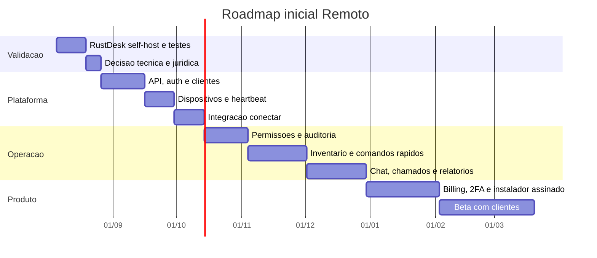

# MVP e Roadmap

## Estrategia

Construir primeiro a plataforma online em volta de um motor de acesso remoto existente. RustDesk e o candidato inicial por ser open source, maduro e self-hosted, mas a decisao final depende de validacao tecnica e juridica da licenca AGPL-3.0.

## MVP 0: validacao tecnica

Prazo estimado: 1 a 2 semanas.

Objetivo: provar que o motor de acesso remoto funciona com infraestrutura propria.

Entregas:

- servidor RustDesk OSS em ambiente de teste;
- cliente apontando para servidor proprio;
- teste em rede local e internet;
- teste de relay quando P2P falhar;
- anotacao de latencia, estabilidade, qualidade de tela e dificuldades de instalacao.

Critério de pronto:

- uma maquina controladora acessa uma maquina remota usando servidor proprio;
- o fluxo e repetivel;
- riscos tecnicos e de licenca ficam documentados.

## MVP 1: plataforma online basica

Prazo estimado: 30 a 45 dias.

Objetivo: criar o painel online que transforma o motor remoto em produto.

Entregas:

- login de administrador e tecnico;
- cadastro de empresas/clientes;
- cadastro de dispositivos;
- status online/offline por heartbeat;
- grupos de dispositivos;
- perfil basico de dispositivo;
- botao para iniciar conexao remota;
- log de tentativa de acesso;
- instalador/configuracao por cliente.

Critério de pronto:

- tecnico entra no painel, escolhe cliente, ve maquinas online e inicia o acesso;
- cada acesso gera registro;
- administrador consegue bloquear ou liberar tecnico.

## MVP 2: suporte tecnico operacional

Prazo estimado: 2 a 3 meses.

Objetivo: tornar a ferramenta util no dia a dia de suporte.

Entregas:

- permissoes por papel;
- inventario basico: SO, CPU, RAM, disco, usuario, IP, programas principais;
- comandos rapidos: reiniciar, listar processos, listar servicos, coletar diagnostico;
- chat por dispositivo;
- anexo de arquivos e transferencia assistida;
- historico por cliente e maquina;
- alertas simples de CPU, memoria e disco.

Critério de pronto:

- suporte resolve parte dos casos pelo painel sem abrir sessao remota;
- toda acao sensivel fica registrada.

## MVP 3: produto vendavel

Prazo estimado: 4 a 6 meses.

Objetivo: preparar uso por clientes reais pagantes.

Entregas:

- cobranca/assinaturas;
- convite de equipe;
- trilha de auditoria completa;
- gravacao de sessao, se tecnicamente viavel no motor escolhido;
- politicas de acesso nao assistido;
- 2FA;
- relatorios;
- instalador assinado;
- atualizacao automatica do agente;
- pagina de status e monitoramento interno.

Critério de pronto:

- operacao consegue atender clientes reais com risco controlado;
- suporte, logs, permissoes e rollback estao definidos.

## Roadmap macro

## Estimativa honesta

- Demo tecnica: 2 semanas.
- MVP apresentavel: 45 dias.
- MVP operacional: 2 a 3 meses.
- Produto vendavel inicial: 4 a 6 meses.
- Plataforma comparavel a concorrentes maduros: 12 meses ou mais.

