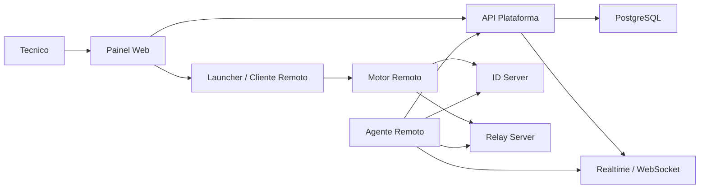
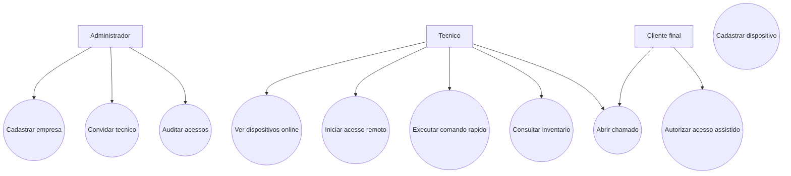
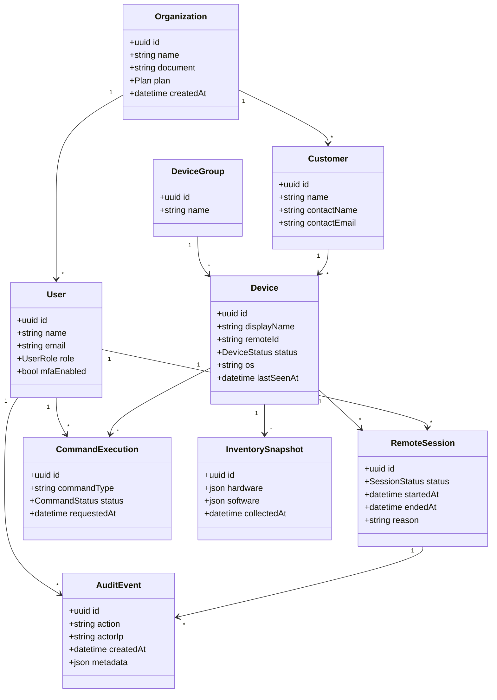
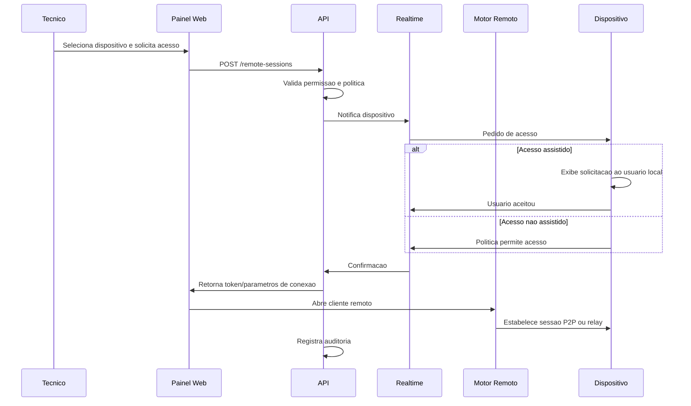
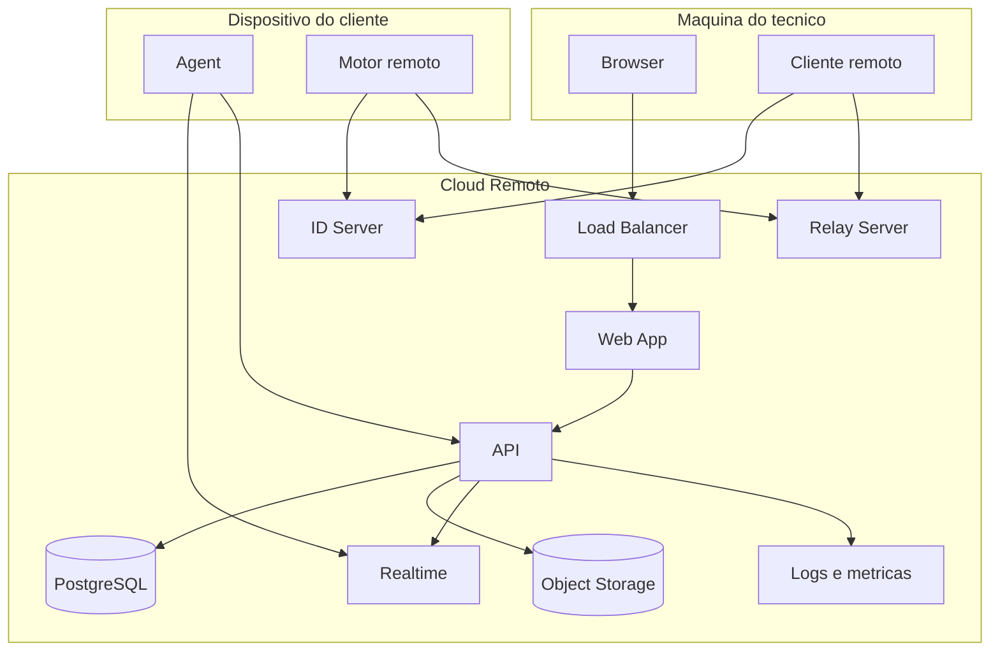

# Arquitetura

## Decisao de arquitetura inicial

Criar uma plataforma online propria e usar um motor remoto como componente acoplado. No MVP, RustDesk pode ser usado como motor de conexao, ID server e relay. A plataforma propria cuida de usuario, cliente, permissao, inventario, auditoria, comandos e experiencia comercial.

## Componentes

- Web App: painel online para tecnicos, administradores e clientes.
- API: regra de negocio, autenticacao, dispositivos, permissoes e logs.
- Realtime: heartbeats, presenca e eventos de dispositivos.
- Agent: componente instalado no dispositivo remoto.
- Remote Engine: motor de acesso remoto, inicialmente RustDesk ou integracao equivalente.
- Relay/ID Server: sinalizacao e relay de conexao remota.
- Database: dados transacionais.
- Object Storage: gravações, anexos e relatorios exportados.
- Observability: metricas, logs e auditoria interna.

## Fluxo simplificado



## UML: casos de uso



## UML: modelo de dominio



## UML: sequencia de acesso remoto



## UML: deployment



## APIs iniciais

```text
POST   /auth/login
POST   /auth/mfa/verify
GET    /organizations/current
GET    /customers
POST   /customers
GET    /devices
POST   /devices/register
POST   /devices/:id/heartbeat
GET    /devices/:id
POST   /devices/:id/commands
GET    /devices/:id/inventory
POST   /remote-sessions
GET    /remote-sessions
GET    /audit-events
```

## Decisao RustDesk

Usar RustDesk no MVP nao significa depender dele para sempre.

Opcoes:

1. Integracao externa: usar cliente e servidor RustDesk quase sem modificacao.
2. Fork aberto: modificar com compliance AGPL e publicar alteracoes exigidas.
3. Motor proprio gradual: manter painel proprio e substituir partes do motor remoto com o tempo.

Para produto comercial, a opcao 1 e melhor para validar. A opcao 3 e melhor para independencia no longo prazo.

